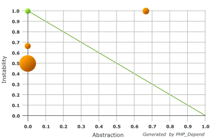
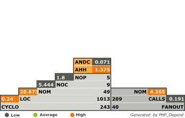

Fluidpages: Fluid Page Templates
================================

> **Fluid Pages** enables page template selection and rendering á la TemplaVoila - but using Fluid templates. The feature was born
> in the extension FED and ported into this extension, making a very light (actually bordering on simple) extension. It uses Flux
> to enable highly dynamic configuration of variables used when rendering the template.

[](https://travis-ci.org/FluidTYPO3/fluidpages)

## Code Quality




_Understanding the [Abstraction Instability Chart](http://pdepend.org/documentation/handbook/reports/abstraction-instability-chart.html)
and [Pyramid Chart](http://pdepend.org/documentation/handbook/reports/overview-pyramid.html)._

## What does it do?

EXT:fluidpages enables the use of Fluid templates as page templates, each template file acting like an individual template. The
template files are processed by the extension and a simplified method of selecting templates (two selector boxes, one for current
page and one for subpage templates, like TemplaVoila).

## Why use it?

Although the FLUIDTEMPLATE object in TypoScript allows Fluid templates to be used as page templates, it has limited capabilities.
Using EXT:fluidtemplate the page templates are not only selectable in page properties but also rendered from a proper Controller.

In addition to this, Fluid Pages uses all the power of Flux to allow the template to contain dynamic but very compact configuration
sections - which translate to fields in the page properties, the values of which are available when rendering the template.

When combined with the VHS extension this becomes a very powerful tool: the dynamic nature of Fluid templates and the flexibility
of ViewHelpers - combined with extremely easy-to-use configuration options.

## How does it work?

Fluid Pages are registered through TypoScript. The template files are then processed and the configuration contained in each is
recorded and used to identify the page template when being selected by content editors.

When editing the page a Flux ConfigurationProvider takes care of processing the specific template's configuration and presenting
it as fields available to the content editor much like TemplaVoila.

Page templates work best if they are shipped (and created) in an extension, the key of which is used by identify the page
templates in relation to the Fluid Pages extension. This makes the templates excellently portable and allow you to quickly add
custom ViewHelpers used by your specific page templates. Such an extension need only contain an `ext_emconf.php` file and
optionally a static TypoScript configuration and an `ext_localconf.php` to register that TypoScript static configuration. Using
a static file makes it easy to include the page template.

> Note: You can of course place your template files in fileadmin or another location, but this has disadvantages. The short
> description of these disadvantages: everything you can normally do in Extbase and Fluid when working in an extension, becomes
> impossible - or requires the use of many workarounds / additional attributes just to operate the most basic ViewHelpers.

## How to include page templates

Use the following TypoScript:

```
plugin.tx_fluidpages.collections.myextension {
	templateRootPath = EXT:myextension/Resources/Private/Templates/
	partialRootPath = EXT:myextension/Resources/Private/Partials/
	layoutRootPath = EXT:myextension/Resources/Private/Layouts/
}
```

Or this line in ext_tables.php and ext_localconf.php (double registration _is_ necessary):

```
Tx_Flux_Core::registerProviderExtensionKey('myextensionkey', 'Page');
```

Or if your extension uses namespaces **and contain a vendor name**:

```
Tx_Flux_Core::registerProviderExtensionKey('VendorName.ExtensionName', 'Page');
```

Fluid Pages transparently recognises the difference between a lowercase_underscored extension key and a Vendor.ExtensioName syntax.

> Note: the extension key you use when registering templates will also be used as extension name for the controller context used
in rendering the Fluid template (in other words: things like `<v:translate>` and `{f:uri.resource()}` will use your extension's
scope - and thus will create links to your extension's resources, LLL labels etc).

## The PageController

Fluid Pages emulates a `Page` object and an associated `PageController` - therefore, Fluid Pages will look for template files in
the location `templateRootPath` . `/Page/` which becomes `EXT:myextension/Resources/Private/Templates/Page/`, just as if you had
created a Page domain object and used a PageController to render an action, the action corresponding to the selected page template.

When included the page templates are made available to select in page properties in locations where you make the TypoScript
available. _Because an Extbase context is used you should include the TypoScript in root templates always, never in extended
templates unless you also include those in a root template_. The reason for this is a slightly off behavior that Extbase exhibits
when there is no page UID available - which happens in some actions of the page backend module.

## Using an Extbase controller native to your extension

When you use an extension to provide your templates you will implicitly get the option to create a custom controller which will
be used to render your individual page templates. In addition to using your extension's scope this also allows you to use a proper
controller context - including arguments. To create such a controller you only need to add the class and extend the right parent.

Each "action" method on the controller then corresponds to one template file - just like a normal Extbase controller:

```
class Tx_Myext_Controller_PageController extends Tx_Fluidpages_Controller_AbstractPageController {

	public function defaultAction() {
		// this action renders the template EXT:myext/Resources/Private/Templates/Page/Default.html
		// - optionally placed in another path if you override the view configuration using TypoScript.
	}

}
```

Actions which do not exist do not get called. If a template file exists but has no corresponding controller action, the default
Fluid Pages PageController does the job instead.

In every way this controller is a regular controller with just a few added internal properties. However, some parts of the view
does get overridden and may not act the way you expect. One such concern: do not attempt to override the `viewObjectName` - this
object name has already been overriddden by Flux (serving as base of Fluid Pages) and overriding it again may cause ill effects,
unless of course you also use a subclass of the Flux view class. There are other circumstances like this one so be prepared for
some additional workarounds if you attempt overrides.

## How to create page template files

Creating templates follows all the rules of Fluid templates. If you use a Layout, it must be located in the path you configured
in TypoScript. If rendering Partials, these must be located in the correct path as well. You may use any ViewHelpers you need -
recommended is the comprehensive set provided by EXT:vhs, which includes a great collection of page/content rendering ViewHelpers.
Since all rules of Fluid are followed there is only one single additional requirement to enable a Fluid template to be used as
a page template: a `Configuration` section in the template file (for example
EXT:myextension/Resources/Private/Templates/Page/FrontPage.html):

```xml
{namespace v=Tx_Vhs_ViewHelpers}
{namespace flux=Tx_Flux_ViewHelpers}
<f:layout name="Page" />
<div xmlns="http://www.w3.org/1999/xhtml" lang="en"
     xmlns:v="http://fedext.net/ns/vhs/ViewHelpers"
     xmlns:flux="http://fedext.net/ns/flux/ViewHelpers"
     xmlns:f="http://typo3.org/ns/fluid/ViewHelpers">

<f:section name="Configuration">
	<flux:form id="sample-page" label="Sample Fluid page">
		<flux:field.input name="settings.entryLevel"
			label="Main menu entry level override for this page only"
			eval="int,trim" minimum="0" maximum="6"
			default="{v:var.typoscript(path: 'lib.menu.main.entryLevel')}">
			<flux:wizard.slider hideParent="TRUE" step="1" width="100" />
		</flux:field.input>
	</flux:form>
	<flux:grid>
        <flux:grid.row>
            <flux:grid.column colPos="1" name="Hero Unit" />
        </flux:grid.row>
        <flux:grid.row>
            <flux:grid.column colPos="0" name="Main Content" />
        </flux:grid.row>
        <flux:grid.row>
            <flux:grid.column colPos="2" name="Footer Content" />
        </flux:grid.row>
    </flux:grid>
</f:section>

<f:section name="Content">
	<v:page.content.render column="0" />
</f:section>

<f:section name="AnotherSection">
	<!-- more sections as desired, rendering triggered from the "Page.html" Layout file -->
</f:section>

</div>
```

### An explanation of the above template

Some facts about the above sample template:

* The `flux` namespace is used for configuration, the `v` namespace for output.
* A `<div>` wraps the entire template, allowing tag autocompletion and attribute validation (by associating XSD schemas to each
  namespace - see https://github.com/FluidTYPO3/schemaker for more information about this feature).
* The `Page.html`  Layout file is used. It is allowed to render any section **except for the `Configuration` section**
* The `Configuration` section contains:
	* A `<flux:form>` node with the minimum allowed configuration: an ID unique to this file (among files in this same
	  extension) and a human-readable label presented to content editors when selecting page templates.
	* A `<flux:field.input>` field allowing the menu's entry level to be defined in each page's properties
	* A `<flux:wizard.slider>` which replaces the `<flux:field.input>` with a slider to select the
	  menu's entry level between 1 and 6.
	* A `<flux:grid>` which defines a Backend Layout to be used if no other Backend Layout is selected in TYPO3. __Note
	  that this particular feature only works on TYPO3 6.0 and above.__

The template does not contain an example of rendering a menu - you can find a more detailed example by viewing the files in
`EXT:fluidpages/Resources/Private/Templates/`, `EXT:fluidpages/Resources/Private/Layouts/` and
`EXT:fluidpages/Resources/Private/Partials/`.

## Incompatibilities

Using EXT:view Fluid Page template rendering cannot be overlaid - but arguments for ViewHelpers used in page templates can.

Backend Layouts defined directly in the page template (and thus dynamic just like other Flux FlexForm configurations) is only
supported on TYPO3 6.0 and above. On 4.x branches you still have to use the traditional Backend Layout records.

Currently it is not possible to run alongside TemplaVoila - which should come as no surprise and most likely is not a factor.
If you chose Fluid Pages you should not need TemplaVoila (the extension Fluid Content can be used to create content elements that
work like TemplaVoila's flexible content elements, but written in Fluid and allowing the same type of configuration as Fluid
Pages - see https://github.com/FluidTYPO3/fluidcontent). If you chose TemplaVoila you do not have the option of using Fluid
Pages - but you will be able to use the Fluid Content extension.

There is no plan to make Fluid Pages compatible with TemplaVoila - sorry, all TemplaVoila users. I hope you will consider Fluid
Pages for your next site!

## References

Other extensions which are either dependencies of or closely related to this extension:

* https://github.com/FluidTYPO3/flux is a dependency and is used to configure how the page template variable are defined.
* https://github.com/FluidTYPO3/vhs is a highly suggested companion for Fluid Pages templates, providing useful ViewHelpers.
* https://github.com/FluidTYPO3/fluidcontent is a suggested companion for sites built with Fluid Pages.
* https://github.com/FluidTYPO3/schemaker is a nice-to-have tool to generate XSD schemas for a great Fluid experience.
